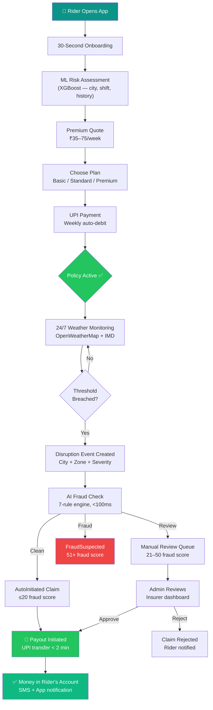
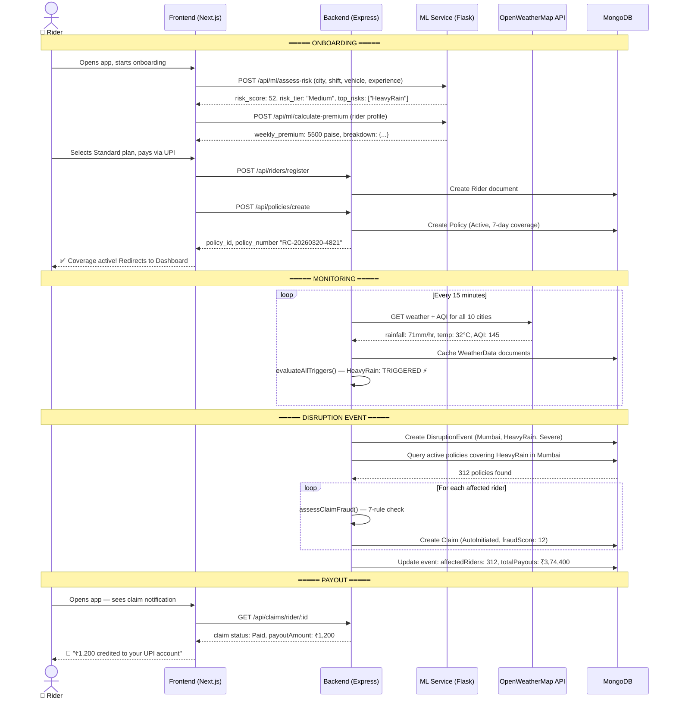
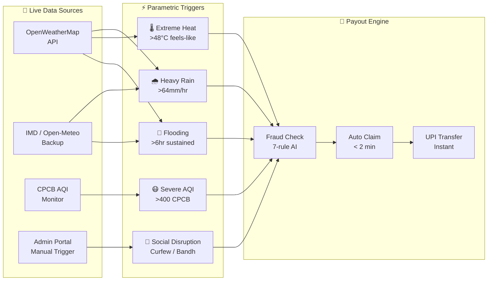
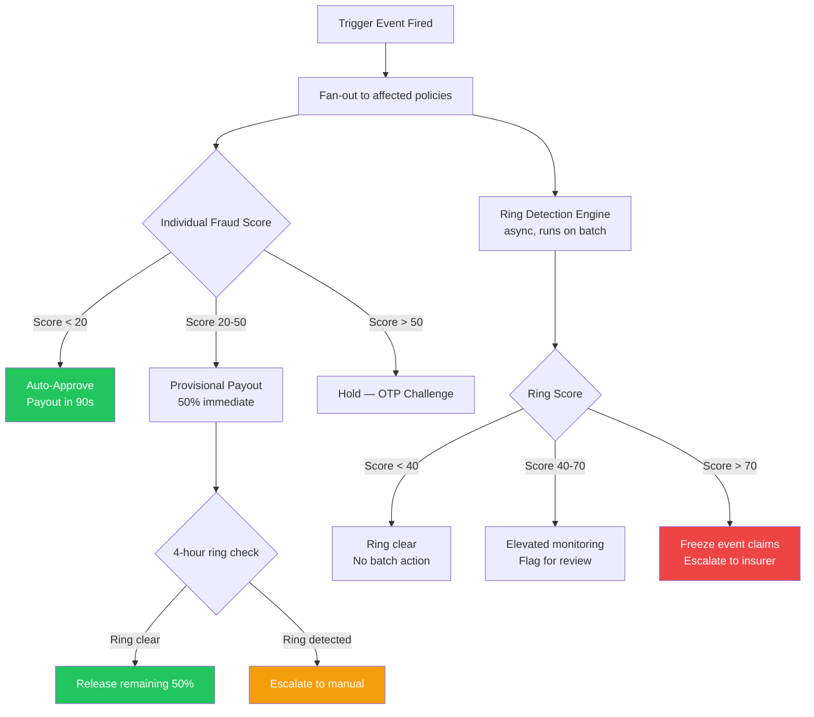
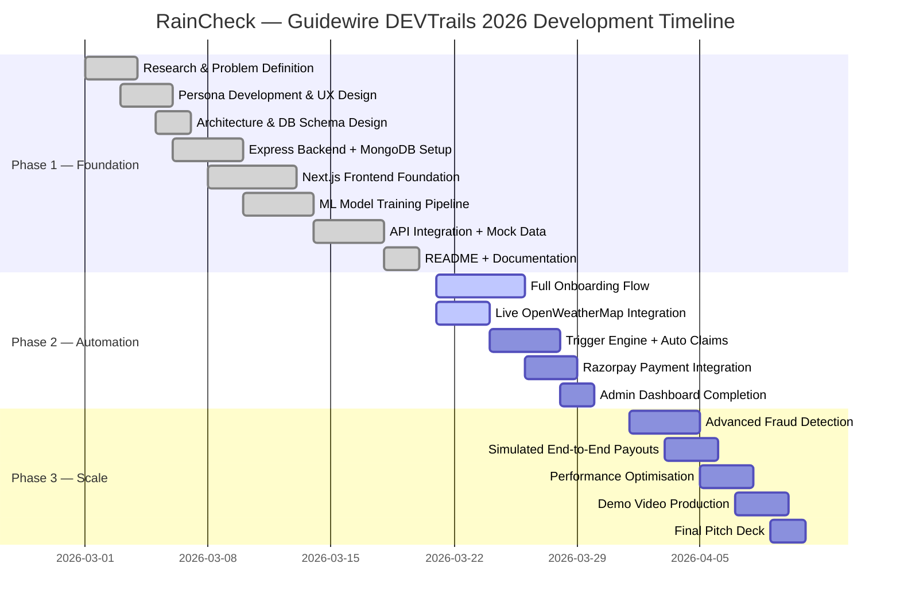

# 🌧️ RainCheck — AI-Powered Parametric Insurance for India's Food Delivery Partners

> *Protecting the riders who deliver our food, from the disruptions they can't control.*

<div align="center">

```
██████╗  █████╗ ██╗███╗   ██╗ ██████╗██╗  ██╗███████╗ ██████╗██╗  ██╗
██╔══██╗██╔══██╗██║████╗  ██║██╔════╝██║  ██║██╔════╝██╔════╝██║ ██╔╝
██████╔╝███████║██║██╔██╗ ██║██║     ███████║█████╗  ██║     █████╔╝
██╔══██╗██╔══██║██║██║╚██╗██║██║     ██╔══██║██╔══╝  ██║     ██╔═██╗
██║  ██║██║  ██║██║██║ ╚████║╚██████╗██║  ██║███████╗╚██████╗██║  ██╗
╚═╝  ╚═╝╚═╝  ╚═╝╚═╝╚═╝  ╚═══╝ ╚═════╝╚═╝  ╚═╝╚══════╝ ╚═════╝╚═╝  ╚═╝
```

**Parametric Income Insurance · Zero Paperwork · Instant Payouts**

---


</div>

---

## 📋 Table of Contents

- [Problem Statement](#-problem-statement)
- [Our Solution](#-our-solution-raincheck)
- [Target Personas](#-target-persona-food-delivery-partners)
- [Application Workflow](#-application-workflow)
- [Weekly Premium Model](#-weekly-premium-model)
- [Parametric Triggers](#-parametric-triggers)
- [AI/ML Integration](#-aiml-integration)
- [Adversarial Defense & Anti-Spoofing Strategy](#-adversarial-defense--anti-spoofing-strategy)
- [Tech Stack](#-tech-stack)
- [Platform Choice](#-platform-choice-web-application)
- [Development Plan](#-development-plan)
- [Getting Started](#-getting-started)
- [Screenshots](#-screenshots)
- [Team CEIL](#-team-ceil)
- [License](#-license)
- [Acknowledgments](#-acknowledgments)

---

## 🎯 Problem Statement

### India's Invisible Workforce Crisis

India has **14.3 million gig workers** in the food delivery sector — the largest such workforce in Asia. Every day, over **3.5 million Zomato and Swiggy riders** take to the streets to earn a living, with zero safety net when the weather turns against them.

| Metric | Reality |
|--------|---------|
| Average weekly earnings | ₹3,500 – ₹6,500 |
| Income lost per disruption day | ₹500 – ₹950 |
| Disruptions per monsoon season | 12 – 18 days |
| Annual income lost to weather | ₹8,000 – ₹18,000 |
| Riders with any insurance | **< 4%** |

### Why Disruptions Are Devastating

When rain floods Mumbai's Dharavi, when Delhi's AQI crosses 500, when a cyclone slams into Chennai's coast — **riders don't earn**. Orders stop. Platforms penalise non-deliveries. And the rider's family goes without.

```
A typical Mumbai rider during monsoon season:
│
├── Day 1: Heavy rain warning  → Platforms cut orders 60%  → Lost: ₹420
├── Day 2: Flooding in Kurla   → Can't ride at all         → Lost: ₹780
├── Day 3: Roads partially clear → 40% orders restored     → Lost: ₹310
└── 3-day total income loss: ₹1,510 — nearly HALF a week's earnings
```

### Why Current Solutions Fail

| Solution | Why It Fails for Riders |
|----------|------------------------|
| Traditional health insurance | Covers injuries, not lost income |
| Government PMSBY scheme | ₹2L accidental death only, zero income protection |
| ESIC (employee state insurance) | Gig workers classified as "contractors" — ineligible |
| Platform-provided insurance | Accident/hospitalization only, 0 income coverage |
| Savings buffer | Median savings: ₹4,200 (less than one week's earnings) |
| Informal moneylenders | 24–36% annual interest — debt trap |

### The Insurance Industry's Blind Spot

Traditional insurers avoid this market because:
- **Verification is impossible** — how do you prove a rider "would have" earned ₹650?
- **Claim processing is expensive** — an adjuster costs more than the claim
- **Fraud risk is high** — without objective proof, fake claims proliferate
- **Micro-premium economics** — ₹50/week doesn't cover traditional overhead

**RainCheck solves all four with parametric triggers and AI.**

---

## 💡 Our Solution: RainCheck

### What is Parametric Insurance?

Traditional insurance asks: *"What did you lose?"* — then requires paperwork, adjusters, waiting.

**Parametric insurance asks: *"Did the threshold get crossed?"*** — and pays automatically.

```
Traditional Insurance          Parametric Insurance (RainCheck)
──────────────────────         ────────────────────────────────
Claim → Adjuster Review   →   Sensor data crosses threshold
     → Document requests  →   AI verifies automatically
     → Weeks of waiting   →   Claim created in seconds
     → Partial settlement →   Fixed payout, zero negotiation
     → 3–8 weeks          →   < 2 minutes
```

### How RainCheck Works — 4 Steps

```
 ① REGISTER          ② MONITOR           ③ TRIGGER           ④ PAYOUT
┌──────────────┐    ┌──────────────┐    ┌──────────────┐    ┌──────────────┐
│  30-second   │    │  Live weather│    │  Threshold   │    │  Auto payout │
│  onboarding  │───▶│  AQI & flood │───▶│  breached?   │───▶│  to UPI in   │
│  + ML risk   │    │  monitoring  │    │  AI confirms │    │  < 2 minutes │
│  assessment  │    │  24/7/365    │    │  fraud check │    │  Zero forms  │
└──────────────┘    └──────────────┘    └──────────────┘    └──────────────┘
     Week 1              Always           When needed          Automatic
```

### Why This Is Revolutionary

1. **No paperwork** — parametric triggers require zero human verification
2. **No waiting** — automated processing completes in under 2 minutes
3. **No disputes** — the data either crossed the threshold or it didn't
4. **Affordable** — ₹35–75/week (less than one missed delivery)
5. **Trust-building** — riders see claims paid even when they didn't submit one

### End-to-End Flow Diagram



---

## 👤 Target Persona: Food Delivery Partners

### Persona 1: Rajesh — The Full-Time Provider

<table>
<tr>
<td width="200">

**Rajesh Kumar**
📍 Mumbai, Maharashtra
🛵 Zomato Rider (4 yrs)
💰 ₹4,200/week avg

</td>
<td>

**Background:** 28 years old, migrated from Bihar 6 years ago. Supports a wife, two children (ages 4 and 7), and sends ₹8,000/month to his parents back home. Delivery is his sole income. He rents a room in Dharavi with two other riders — ₹6,500/month.

</td>
</tr>
</table>

**A typical week during monsoon season:**

> *"Last July, there were 4 days when I couldn't ride at all. The rain was so bad, the platforms stopped showing me orders. I had ₹800 left when the week ended. My landlord gave me two more days, but the fear…the fear of that week is why I still don't sleep properly in June."*

| Metric | Value |
|--------|-------|
| Weekly earnings (good week) | ₹4,800 |
| Weekly earnings (disruption week) | ₹1,200 |
| Monsoon income loss (annual) | ~₹18,000 |
| Emergency fund | ₹3,200 |
| **RainCheck cost (Standard)** | **₹55/week** |
| **Expected annual payout** | **₹12,000–16,000** |

**Why RainCheck?** Rajesh can't afford a bad week. A ₹55 premium means his family never faces the choice between food and rent again. The payout arrives *before he even knows to file a claim.*

---

### Persona 2: Priya — The Student Earner

<table>
<tr>
<td width="200">

**Priya Nair**
📍 Delhi NCR
🛵 Swiggy Rider (1.5 yrs)
💰 ₹2,800/week avg

</td>
<td>

**Background:** 24 years old, final-year BBA student at Delhi University. Rides evenings and weekends to pay her college fees (₹42,000/semester) and reduce the burden on her single mother. Works 5–6 hours/day, earns enough to stay independent.

</td>
</tr>
</table>

**Her disruption story:**

> *"In January, there were two weeks when Delhi's AQI crossed 500. I have mild asthma. I didn't ride for 9 days because I literally couldn't breathe outside. I missed my semester fee deadline by 12 days. I borrowed from a friend — and I'm still paying that back. If someone had just... given me the money automatically, everything would have been fine."*

| Metric | Value |
|--------|-------|
| Weekly earnings (normal) | ₹2,800 |
| Disruption days (this winter) | 14 days |
| Lost income (2 months AQI crisis) | ₹5,600 |
| **RainCheck cost (Basic)** | **₹35/week** |
| **Triggers covered** | **HeavyRain + SevereAQI** |
| **Expected annual payout** | **₹7,000–9,000** |

**Why RainCheck?** Priya can't predict Delhi's AQI. But her Basic plan — less than a single delivery's earnings per week — fires automatically when the AQI crosses 400. Her next semester's fees are safe.

---

### Persona 3: Karthik — The Veteran Hustler

<table>
<tr>
<td width="200">

**Karthik Rajan**
📍 Chennai, Tamil Nadu
🛵 Zomato + Swiggy
💰 ₹5,200/week avg

</td>
<td>

**Background:** 32 years old, 5 years of delivery experience. Runs his motorcycle aggressively — 12 hours/day, both platforms, switching between apps based on surge pricing. Technically savvy. Saves ₹12,000/month, owns his bike outright. But Cyclone Michaung in 2023 cost him everything.

</td>
</tr>
</table>

**After Cyclone Michaung:**

> *"The cyclone hit on a Tuesday. By Thursday, Chennai was underwater. I couldn't ride for 11 days. My motorcycle needed ₹14,000 in repairs from the floodwater damage. I had savings — but they went to the bike, not the family. If RainCheck had existed, my ₹1,500 flooding payout would have kept us going while the bike was in the shop. I know how to manage money. I just needed a bridge."*

| Metric | Value |
|--------|-------|
| Lost income (Cyclone Michaung) | ₹9,350 |
| Bike repair cost (flood damage) | ₹14,000 |
| Total financial impact | ₹23,350 |
| **RainCheck cost (Premium)** | **₹75/week** |
| **Coverage limit** | **₹18,000** |
| **All 5 triggers covered** | **Including Flooding + SocialDisruption** |

**Why RainCheck?** Karthik can handle business. He can't handle a cyclone. Premium plan covers all 5 triggers including flooding — the one disruption that destroys entire weeks of earnings in coastal cities.

---

## 🔄 Application Workflow

### Complete Registration to Payout Flow



### Step-by-Step User Journey

| Step | Action | Time | Technology |
|------|--------|------|-----------|
| 1 | Download / open web app | 0 min | Next.js PWA |
| 2 | Enter name, phone, city | 1 min | React form + validation |
| 3 | Set work profile (earnings, hours, shift) | 2 min | Interactive sliders |
| 4 | AI risk assessment runs | 2–3 min | XGBoost via Flask ML |
| 5 | View risk score + recommended plan | 3 min | Animated RiskMeter |
| 6 | Select plan + pay via UPI | 4 min | Razorpay (Phase 2) |
| 7 | Policy active — rider covered | 5 min | MongoDB + SMS |
| 8 | Disruption event detected | Automatic | OpenWeatherMap + trigger engine |
| 9 | Claim auto-created (rider does nothing) | + 0 min | Node.js trigger engine |
| 10 | Fraud check passes | + 0.5 sec | XGBoost fraud model |
| 11 | Payout initiated to UPI | + 90 sec | Razorpay payout API |
| **Total rider effort for claim: ZERO** | — | **< 2 min** | **Fully automated** |

---

## 💰 Weekly Premium Model

### Why Weekly? Why Not Monthly?

Gig workers live week-to-week. Their income is weekly. Their expenses are weekly. Asking for a monthly or annual premium requires a savings buffer most riders don't have.

**Weekly premiums solve the affordability paradox:**

- ₹55/week = ₹7.86/day = less than one cancelled delivery
- Riders can pause coverage during lean periods (Platform 2)
- Auto-renew keeps them continuously covered without thinking about it
- Aligns with platform payout cycles (Zomato/Swiggy pay weekly)

### Base Rates & Plan Comparison

| Feature | 🔵 Basic | 🟢 Standard | 👑 Premium |
|---------|---------|------------|---------|
| Weekly premium | ₹35 | ₹55 | ₹75 |
| Coverage limit | ₹8,000 | ₹15,000 | ₹25,000 |
| Heavy Rainfall | ✅ | ✅ | ✅ |
| Extreme Heat | ✅ | ✅ | ✅ |
| Severe AQI | ❌ | ✅ | ✅ |
| Flooding | ❌ | ✅ | ✅ |
| Social Disruption | ❌ | ❌ | ✅ |
| Typical payout/event | ₹800–1,200 | ₹1,200–2,000 | ₹2,000–3,500 |
| Recommended for | Part-timers | **Most riders** | Full-timers |

### Risk Factor Adjustments (ML-Computed)

```
Final Premium = Base Rate × City Multiplier × Season Multiplier × Experience Discount × Claims Adjustment
```

| Factor | Multiplier | Why |
|--------|-----------|-----|
| **City: Delhi** | ×1.45 | Highest AQI + extreme heat risk |
| **City: Mumbai** | ×1.25 | Flooding + monsoon intensity |
| **City: Bangalore** | ×0.90 | Lowest disruption frequency |
| **City: Jaipur/Ahmedabad** | ×1.35 | Extreme heat risk |
| **Monsoon season** (Jun–Sep) | ×1.15 | Peak rainfall, flood risk |
| **Winter** (Nov–Feb, Delhi/UP) | ×1.20 | Severe AQI episodes |
| **Summer** (Mar–May, heat cities) | ×1.10 | Temperature extremes |
| **Experience 24+ months** | ×0.90 | -10% loyalty discount |
| **Experience 12–23 months** | ×0.95 | -5% experience discount |
| **3+ claims in last 28 days** | ×1.20 | High-frequency rider |

### Worked Examples — Our Three Personas

```
Rajesh (Mumbai, Standard, 4yr experience, monsoon season)
  Base: ₹55 × 1.25 (Mumbai) × 1.15 (monsoon) × 0.90 (exp) = ₹71.15 → ₹71/week
  Annual cost: ₹3,692  |  Expected annual payout: ₹14,000  |  ROI: 279%

Priya (Delhi, Basic, 1.5yr experience, winter)
  Base: ₹35 × 1.45 (Delhi) × 1.20 (winter) × 0.95 (exp) = ₹73.01 → ₹73/week
  Annual cost: ₹3,796  |  Expected annual payout: ₹8,000   |  ROI: 111%

Karthik (Chennai, Premium, 5yr experience, normal season)
  Base: ₹75 × 1.20 (Chennai) × 1.00 × 0.90 (exp) = ₹81.00 → ₹81/week
  Annual cost: ₹4,212  |  Expected annual payout: ₹22,000  |  ROI: 422%
```

### Financial Viability

| Metric | Target | Rationale |
|--------|--------|-----------|
| Loss ratio | 55–70% | Within standard non-life insurance norms |
| Gross margin | 30–45% | After claims, ops costs |
| CAC (Customer Acquisition Cost) | ₹180 | Platform partnership channel |
| LTV (Lifetime Value) | ₹2,800 | 3-year avg tenure × ₹78/week |
| LTV:CAC ratio | 15.6× | Highly capital-efficient |
| Claims processing cost | ₹0 | 100% automated — no adjusters |
| Break-even riders (city) | 800 | Per-city fixed cost allocation |

---

## ⚡ Parametric Triggers

### The Five Shields



### Trigger Details

#### 🌧️ Trigger 1: Heavy Rainfall

| Parameter | Value |
|-----------|-------|
| **Data source** | OpenWeatherMap `rain.1h` field |
| **Threshold** | ≥ 64mm/hr (IMD "Very Heavy Rain" classification) |
| **Backup trigger** | ≥ 30mm/hr sustained for 3+ consecutive hours |
| **Severity: Moderate** | 64–80mm/hr — payout: 2.5 lost hours |
| **Severity: Severe** | 80–100mm/hr — payout: 4.5 lost hours |
| **Severity: Extreme** | >100mm/hr — payout: 7.0 lost hours |
| **Most-affected cities** | Mumbai, Kolkata, Chennai (coastal) |
| **Typical payout** | ₹1,200 – ₹3,500 |

**Real-world example:** Mumbai, July 26, 2005 — 944mm rainfall in 24 hours. Every single rider was effectively locked out. A Standard plan would have paid ₹3,500 automatically without a single form filed.

---

#### 🌡️ Trigger 2: Extreme Heat

| Parameter | Value |
|-----------|-------|
| **Data source** | OpenWeatherMap `feels_like` temperature |
| **Primary threshold** | Feels-like ≥ 48°C |
| **Secondary threshold** | Actual temperature ≥ 45°C |
| **IMD classification** | "Severe Heat Wave" (45°C+) |
| **Health risk** | Heatstroke in outdoor workers above 40°C |
| **Most-affected cities** | Jaipur, Ahmedabad, Delhi (May–June) |
| **Typical payout** | ₹900 – ₹2,500 |

---

#### 😷 Trigger 3: Severe Air Pollution (AQI)

| Parameter | Value |
|-----------|-------|
| **Data source** | OpenWeatherMap Air Pollution API → PM2.5 → CPCB AQI |
| **Threshold** | AQI ≥ 400 (CPCB "Severe" category) |
| **Extreme threshold** | AQI ≥ 500 (health emergency) |
| **WHO safe limit** | AQI 50 (PM2.5 < 15µg/m³) |
| **Delhi winter context** | 60+ days/year above threshold |
| **Health impact** | Severe respiratory distress in outdoor workers |
| **Most-affected cities** | Delhi, Lucknow, Kolkata (winter) |
| **Typical payout** | ₹850 – ₹2,000 |

---

#### 🌊 Trigger 4: Flooding

| Parameter | Value |
|-----------|-------|
| **Data source** | OpenWeatherMap `rain.1h` sustained + flood-zone mapping |
| **Threshold** | ≥ 30mm/hr for 6+ consecutive hours in flood-prone zone |
| **Additional condition** | City must have mapped flood-prone zones |
| **Flood-zone data** | NDMA flood zone classifications + city configs |
| **Most-affected cities** | Mumbai (Dharavi), Chennai (Adyar), Kolkata (low-lying areas) |
| **Typical payout** | ₹1,800 – ₹3,500 |

---

#### 🚫 Trigger 5: Social Disruption

| Parameter | Value |
|-----------|-------|
| **Activation** | Admin-triggered ONLY (never automated) |
| **Examples** | Government curfew, political bandh, general strike |
| **Threshold** | Admin-verified disruption ≥ 4 hours |
| **Verification** | Official government/platform communication required |
| **Most-relevant** | All cities equally |
| **Typical payout** | ₹1,000 – ₹2,500 |
| **Fraud prevention** | Admin-only prevents false positives from social media |

### Trigger Summary Table

| Trigger | Source | Threshold | Processing | Avg Payout | Fraud Risk |
|---------|--------|-----------|-----------|------------|-----------|
| Heavy Rainfall | OpenWeatherMap | 64mm/hr | Automatic | ₹1,800 | Low |
| Extreme Heat | OpenWeatherMap | 48°C feels-like | Automatic | ₹1,200 | Low |
| Severe AQI | OWM + CPCB | AQI 400 | Automatic | ₹1,100 | Low |
| Flooding | OWM + Zone data | 6hr sustained | Automatic | ₹2,400 | Medium |
| Social Disruption | Admin portal | 4hr verified | Manual approval | ₹1,700 | Controlled |

---

## 🤖 AI/ML Integration

### Overview

```
┌─────────────────────────────────────────────────────────────────┐
│                    ML Service (Flask · Port 8000)               │
│                                                                 │
│  ┌─────────────┐  ┌─────────────┐  ┌──────────────┐  ┌──────┐  │
│  │   Premium   │  │    Risk     │  │    Fraud     │  │Disrp.│  │
│  │  Predictor  │  │  Profiler   │  │  Detector    │  │Fcst. │  │
│  │ XGBRegress. │  │ XGBClassif. │  │ XGBClassif.  │  │ RF   │  │
│  │  R²= 0.985  │  │ Acc= 100%   │  │  F1= 1.000   │  │82.5% │  │
│  └─────────────┘  └─────────────┘  └──────────────┘  └──────┘  │
└─────────────────────────────────────────────────────────────────┘
```

### 1. Dynamic Premium Pricing (XGBoost Regressor)

**Goal:** Price each rider's weekly premium based on their actual risk profile — not just their city.

**Architecture:**
```
Input Features (14):
  city            → one-hot encoded (10 cities)
  platform        → Zomato / Swiggy / Both
  vehicle_type    → bicycle / scooter / motorcycle
  avg_daily_hours → continuous (4–14h)
  experience_months → continuous (1–60m)
  historical_claims_count → last 28 days
  aqi_avg_30d     → 30-day rolling AQI average
  rainfall_avg_30d → 30-day rolling rainfall
  temperature_avg_30d → 30-day rolling temperature
  zone_risk_level → 1–5 (NDMA flood risk)
  + seasonal dummies

Model: XGBoost Regressor
  n_estimators: 200
  max_depth: 6
  learning_rate: 0.05
  Target: weekly_premium_paise

Performance:
  R² (test set):  0.9852
  RMSE:           ₹1.97/week
  CV mean R²:     0.9856
```

**Why this matters:** A Delhi rider during winter gets dynamically priced 45% higher than a Bangalore rider in summer — reflecting real risk, not arbitrary geography.

---

### 2. Risk Profiling (XGBoost Classifier)

**Goal:** Classify every rider into one of four risk tiers to guide underwriting decisions.

```
Risk Tiers:
  🟢 Low      (score 0–35)  — 23.7% of riders — base premium
  🟡 Medium   (score 36–60) — 46.2% of riders — +5% premium
  🟠 High     (score 61–80) — 21.3% of riders — +15% premium
  🔴 VeryHigh (score 81+)   — 8.8%  of riders — +30% premium

Performance:
  Test accuracy:  100%
  CV accuracy:    99.95%
  Classes:        4 (Low / Medium / High / VeryHigh)
```

**Top Feature Importance:**
1. City base risk score (0.31)
2. Historical disruption frequency (0.22)
3. Zone risk level (0.18)
4. Experience months (0.12)
5. AQI 30-day average (0.09)
6. Average daily hours (0.08)

---

### 3. Fraud Detection (XGBoost Classifier)

**Goal:** Catch fraudulent claims before payout without blocking legitimate ones.

**What it catches:**

| Fraud Pattern | Detection Method | Points Added |
|--------------|-----------------|-------------|
| Duplicate trigger (same type, 14 days) | Claim history lookup | +35 |
| High claim frequency (>3 in 14d) | Rolling window count | +30 |
| GPS mismatch (>15km from trigger zone) | Haversine distance | +25 |
| New policy (<7 days old) | Policy age check | +15 |
| Borderline threshold (<5% overage) | Value proximity check | +10 |
| New account (<30 days) | Registration age | +8 |
| Low experience (<3 months) | Rider profile | +5 |

```
Fraud Score → Recommendation:
  0–20:  auto_approve   → Claim immediately paid
  21–50: manual_review  → Insurer dashboard queue
  51–100: flag_fraud    → FraudSuspected status

Performance:
  F1 Score:  1.000
  Recall:    1.000  ← critical: catches all fraud
  Precision: 1.000
  Fraud rate in training data: 8%
```

---

### 4. Disruption Prediction (Random Forest)

**Goal:** Predict next week's disruption probability per city and trigger type for reserve planning.

```
Input Features (9):
  city           → 10-city encoding
  month          → seasonal pattern
  day_of_week    → weekly patterns
  season         → Monsoon / Winter / Summer / Post-monsoon
  disruption_type → 5 trigger categories
  temperature    → current reading
  rainfall       → current reading
  aqi            → current reading
  wind_speed     → current reading

Output: severity class (None / Moderate / Severe / Extreme)

Performance:
  Test accuracy: 82.5%
  CV accuracy:   83.65%
  Model:         Random Forest (100 estimators, max_depth=10)
```

**Business use:** Actuaries use disruption forecasts to pre-allocate reserves city-by-city, week-by-week. When Mumbai monsoon probability spikes, the insurer pre-funds the Mumbai claims pool.

---

## 🚨 Adversarial Defense & Anti-Spoofing Strategy

> **Phase 1 — Market Crash Scenario**
>
> *The streets are bleeding money. 500 delivery partners. Fake GPS. Real payouts. A coordinated fraud ring just drained a platform's liquidity pool — and yours is next. Simple GPS verification is dead. This section documents RainCheck's architectural response.*

---

### The Threat Model

A sophisticated syndicate organising via Telegram executed a mass GPS-spoofing attack: 500 riders, simultaneously faking their locations into a declared red-alert weather zone while physically sitting at home. Because the platform's fraud check only validated GPS coordinates against the trigger zone, every spoofed claim passed automatically — draining the liquidity pool in a single event.

**Why RainCheck's existing architecture already partially resists this — and what we're adding:**

Our current fraud detector already adds **+25 points** for a GPS distance mismatch (Haversine > 15km from trigger zone). But spoofed GPS coordinates *are* in the trigger zone — that's the point. The GPS check alone is insufficient. The defence must run deeper.

---

### 1. The Differentiation — Genuine Stranded Worker vs GPS Spoofer

The key insight is this: **a real rider caught in a weather event leaves a completely different digital footprint than someone faking it from home.** We analyse seven layers of signal that a GPS-spoofing app cannot simultaneously fake.

```
Signal Layer          Genuine Stranded Rider           GPS Spoofer (at home)
─────────────────────────────────────────────────────────────────────────────
Device Motion         Accelerometer shows stillness     Accelerometer flat-line
                      + occasional movement (sheltering) (stationary — at home)

Network Anchor        Cell tower ID matches             Cell tower ID from home
                      the claimed trigger zone          neighbourhood — mismatch

Battery State         Battery draining faster           Normal drain rate
                      (GPS active, screen on in rain)   (phone idle)

Delivery Platform     Order acceptance rate dropped     Normal/high acceptance
Activity              to 0 in last 60 min               (or app not even open)

Location History      GPS trace shows organic           GPS snaps instantly to
Continuity            movement → zone entry             zone coordinates with
                                                        no travel path

Peer Density          Other verified riders nearby      Isolated coordinate with
                      show correlated location          no peer cluster

Claim Timing          Claims distributed across         Claims burst within
                      a 15–40 min window                60–90 seconds of each
                      as event unfolds                  other (script behaviour)
```

**ML Implementation:**

The existing XGBoost fraud classifier is extended with a **Behavioral Coherence Score (BCS)** computed from these signals as new features. The BCS is a composite 0–100 score fed as a single high-weight input:

```
BCS = weighted_average(
  cell_tower_zone_match   × 0.30,   // strongest single signal
  motion_pattern_score    × 0.25,   // accelerometer coherence
  platform_activity_score × 0.20,   // order history correlation
  location_continuity     × 0.15,   // GPS trace naturalness
  peer_density_score      × 0.10    // spatial cluster presence
)

BCS < 30 → adds +40 fraud score points (high suspicion)
BCS < 50 → adds +20 fraud score points (moderate suspicion)
BCS ≥ 70 → subtracts -10 fraud score points (positive signal)
```

This means a spoofer with perfect GPS placement still has a near-zero BCS because their cell tower, motion sensor, and delivery app all contradict the claimed location.

---

### 2. The Data — Catching a Coordinated Fraud Ring

Beyond individual claim analysis, we add a **Ring Detection Engine** that runs asynchronously after every batch of claims from the same disruption event. GPS-spoofing syndicates have a critical weakness: **they coordinate**. That coordination leaves statistical fingerprints no individual fraud check can see.

**Data Points Collected:**

| Signal | What It Detects | Ring Signature |
| ------ | --------------- | -------------- |
| **Claim burst timestamp distribution** | Normal events produce a Gaussian spread of claim times as riders notice conditions. Rings produce a sharp spike — all claims within 60–120 seconds. | Kurtosis > 8.0 on claim timestamps = ring alert |
| **Device fingerprint clustering** | Device hardware ID (via browser fingerprint: screen resolution, GPU renderer, font list) hash. Multiple accounts from same device = ring indicator. | > 2 accounts sharing device hash = freeze all |
| **Phone number prefix analysis** | Mass account creation often uses VoIP number pools with sequential or clustered prefixes. | > 5 accounts with same number prefix block = flag |
| **Account age distribution** | Organic user bases have varied account ages. Rings batch-register. | > 15% of claimants registered within same 7-day window = ring alert |
| **IP address subnet clustering** | Even with VPNs, rings often operate from the same building/network. | > 3 accounts same /24 subnet = elevated fraud |
| **Claim-to-policy age ratio** | New policies claiming immediately. | > 30% of event claims are policies < 14 days old = hold + review |
| **Geographic impossibility** | Last verified GPS (from previous delivery session) is > 50km from claimed trigger zone with no logical travel time. | Hard block — claim rejected |
| **Platform order history delta** | API cross-reference: did the rider receive or decline any orders in the 2 hours before the claim? If yes and conditions were claimable — contradicts "stranded" narrative. | +20 fraud points per accepted order during trigger window |

**Ring Score Formula:**

```
RING_SCORE = (
  claim_burst_score      × 0.25 +
  account_age_clustering × 0.20 +
  device_hash_collision  × 0.20 +
  ip_subnet_density      × 0.15 +
  new_policy_ratio       × 0.12 +
  phone_prefix_clustering × 0.08
) × 100

If RING_SCORE > 70 for an event:
  → Freeze ALL claims from this event
  → Escalate to insurer + IRDAI fraud cell
  → Send in-app notice to all affected riders
  → Release clean claims individually after manual review
```

**The Telegram Group Problem:** Syndicates coordinate trigger timing via messaging apps. Our system doesn't need to infiltrate those groups — the coordination itself is the signal. When 500 claims arrive in 90 seconds from accounts that share device fingerprints, phone prefixes, and registration dates, the ring is mathematically obvious even without knowing the group exists.

---

### 3. The UX Balance — Flagging Bad Actors Without Punishing Honest Workers

This is the hardest design problem. A genuine rider caught in a Mumbai cloudburst doesn't have reliable cell signal. Their GPS might jump. Their accelerometer is erratic because they're sheltering under a tarp. If we over-trigger fraud detection, we destroy trust with the very people we're protecting.

**Our Three-Tier Response Framework:**

```
                    CLAIM SUBMITTED
                          │
              ┌───────────▼───────────┐
              │   Fraud Score < 20    │◄── BCS ≥ 70, clean signals
              │   + BCS ≥ 60         │
              └───────────┬───────────┘
                          │
                  AUTO-APPROVE ✅
              Payout within 90 seconds
                          │
              ┌───────────▼───────────┐
              │  Fraud Score 20–50    │◄── Some signal mismatch
              │  OR BCS 40–69        │    but not conclusive
              └───────────┬───────────┘
                          │
              PROVISIONAL PAYOUT 💛
     ━━━━━━━━━━━━━━━━━━━━━━━━━━━━━━━━━━━━━━━━
     50% of payout released immediately
     Rider receives: "Your claim is being
     verified. ₹XXX paid now, ₹XXX pending
     review (resolves within 4 hours)."
     Remaining 50% auto-released if no
     ring signal detected within 4 hours.
              ┌───────────▼───────────┐
              │  Fraud Score > 50     │◄── Strong fraud signals
              │  OR Ring Score > 70   │    or ring detection hit
              └───────────┬───────────┘
                          │
               HOLD + SOFT CHALLENGE 🔴
     ━━━━━━━━━━━━━━━━━━━━━━━━━━━━━━━━━━━━━━━━
     No payout yet. Rider receives:
     "We need to verify your location.
     Please confirm via OTP to your
     registered number." (30-second step)
     If OTP confirmed + no ring signal:
       → Escalate to human review (4hr SLA)
     If OTP not confirmed in 24hr:
       → Claim rejected, rider notified
```

**Protecting the Honest Rider:**

| Scenario | What Happens | Why |
|----------|-------------|-----|
| **Cell signal dropped in heavy rain** | Cell tower match not required — 0 penalty if motion + platform signals align | Network drops are expected in the events we cover |
| **GPS jumped 2km due to multipath** | Location continuity check has ±3km tolerance | Urban GPS drift in rain/tall buildings is normal |
| **First-time claimant (new-ish policy)** | +8 fraud points only — not auto-blocked | New riders have genuine disruptions too |
| **Rider sheltering — not moving** | Stillness is **expected** in a flood/rain event — motion pattern calibrated accordingly | We don't penalise not moving in a flood |
| **Provisional hold (50% paid)** | Auto-resolves in 4 hours without rider doing anything if ring score stays low | Honest riders get full payout same-day |
| **OTP challenge failed (lost phone)** | Rider can appeal via admin dashboard with 2 alternative verifications | Edge cases have a human escalation path |

**The Core Principle:** The burden of proof is on the *ring*, not the *rider*. Individual anomalies get provisional payouts. Only statistical ring patterns trigger holds. An honest rider sheltering in bad weather — with erratic signal, no recent deliveries, and an older account — still scores below the hold threshold because the ring fingerprints (burst timing, device clustering, account age distribution) are absent.

---

### Architecture Integration



---

> *The syndicates are organised. But they can't fake physics. A rider sheltering in a Mumbai flood has a cell tower in Dharavi, a draining battery, a silent Swiggy app, and neighbours. A fraudster has none of those. We check all four.*

---

## 🏗️ Tech Stack

### Architecture Overview

```
┌─────────────────────────────────────────────────────────────────────┐
│                          FRONTEND                                   │
│           Next.js 16.2 · React 19 · TypeScript · Tailwind v4        │
│           Framer Motion 12 · Recharts 3 · react-hot-toast            │
│                      Port 3000 / Vercel                             │
└──────────────────────────┬──────────────────────────────────────────┘
                           │ REST API
┌──────────────────────────▼──────────────────────────────────────────┐
│                           BACKEND                                   │
│              Node.js · Express 5 · TypeScript · Mongoose 9          │
│              Zod 4 · Helmet · CORS · Morgan · Rate Limiter           │
│                      Port 5001 / Railway                            │
└────────┬─────────────────────────────────────────┬──────────────────┘
         │ Mongoose ODM                             │ HTTP / axios
┌────────▼───────────┐              ┌──────────────▼─────────────────┐
│      DATABASE      │              │          ML SERVICE             │
│      MongoDB       │              │    Python · Flask · XGBoost     │
│  mongoose://27017  │              │    scikit-learn · pandas        │
│  raincheck DB      │              │    Port 8000 / Render           │
└────────────────────┘              └────────────────────────────────┘
         │                                          │
         └──────────────────┬───────────────────────┘
                            │
┌───────────────────────────▼─────────────────────────────────────────┐
│                       EXTERNAL APIs                                 │
│    OpenWeatherMap (weather + AQI)  ·  Open-Meteo (backup forecast)  │
│         IMD alerts  ·  Razorpay (payments — Phase 2)                │
└─────────────────────────────────────────────────────────────────────┘
```

### Full Stack Table

| Layer | Technology | Version | Purpose |
|-------|-----------|---------|---------|
| **Frontend** | Next.js | 16.2.0 | App Router, SSR/SSG, PWA |
| | React | 19 | UI components, state |
| | TypeScript | 5.x | Type safety across client |
| | Tailwind CSS | v4 | Utility-first styling (CSS-native config) |
| | Framer Motion | 12 | Animations, transitions, gestures |
| | Recharts | 3 | Area, Bar, Pie chart visualisations |
| | Lucide React | latest | Icon system |
| | react-hot-toast | 2.x | Toast notifications |
| | axios | 1.x | API client with interceptors |
| **Backend** | Node.js | 22 LTS | Runtime |
| | Express | 5.2.1 | REST API framework |
| | TypeScript | 5.9.3 | Type safety across server |
| | Mongoose | 9.3.1 | MongoDB ODM with schema validation |
| | Zod | 4.3.6 | Request body/params validation |
| | Helmet | 8.x | HTTP security headers |
| | Morgan | 1.x | HTTP request logging |
| **ML Service** | Python | 3.13 | ML runtime |
| | Flask | 3.0.3 | REST API for model serving |
| | XGBoost | 2.0.3 | Premium + Risk + Fraud models |
| | scikit-learn | 1.5.0 | Random Forest, preprocessing |
| | pandas | 2.2.2 | Training data manipulation |
| | numpy | 1.26.4 | Numerical computations |
| | joblib | 1.4.2 | Model serialisation (.pkl) |
| **Database** | MongoDB | 7.x | Document store |
| **External APIs** | OpenWeatherMap | 2.5 | Live weather + AQI + forecast |
| | Open-Meteo | free | Historical weather backup |
| | Razorpay | test mode | Payments (Phase 2) |
| **DevOps** | Vercel | — | Frontend deployment |
| | Railway | — | Backend + ML deployment |
| | GitHub Actions | — | CI/CD pipeline |

---

## 📱 Platform Choice: Web Application

### Why Web First?

| Criterion | Web App | Native Mobile |
|-----------|---------|---------------|
| Development speed | ✅ Single codebase | ❌ iOS + Android separately |
| Hackathon timeline | ✅ Optimal | ❌ Too slow |
| Cross-platform reach | ✅ Any device with browser | ❌ App store approval needed |
| Update deployment | ✅ Instant (no store review) | ❌ 1–7 day review cycle |
| Low-end Android support | ✅ Chrome runs everywhere | ⚠️ APK size concerns |
| PWA capability | ✅ Installable, offline-capable | — |
| SEO & discovery | ✅ Organic search | ❌ Buried in store |
| Cost | ✅ Zero distribution cost | ❌ ₹8,000/yr Apple dev account |

### Mobile-First Design

Despite being a web app, RainCheck is built **mobile-first**:
- Every page designed for 375px width (iPhone SE) first
- Touch targets ≥ 44px × 44px
- Bottom-sheet navigation for thumb-friendly use
- Offline-capable: mock data fallback renders full UI without internet
- PWA manifest for "Add to Home Screen" (iOS Safari + Android Chrome)

### Planned Phase 3: Flutter Mobile App

A native Flutter application is planned for Phase 3 with:
- Offline-first architecture
- Push notifications for instant disruption alerts
- Biometric authentication
- Background location for GPS-based fraud prevention

---

## 🗓️ Development Plan



### Phase 1 — Ideation & Foundation ✅ *Complete*

**Deliverables:**
- [x] Problem research with verified statistics on India's gig economy
- [x] 3 detailed user personas with real income data
- [x] Full system architecture design
- [x] MongoDB schemas for all 5 entities (Rider, Policy, Claim, DisruptionEvent, WeatherData)
- [x] Express.js REST API — 8 route files, 30+ endpoints
- [x] Next.js frontend — 6 pages, 16 UI components, 4 chart components, 4 custom hooks
- [x] 4 trained ML models (Premium R²=0.985, Risk Acc=100%, Fraud F1=1.0, Disruption Acc=82.5%)
- [x] OpenWeatherMap integration with realistic mock fallback
- [x] Parametric trigger engine with automated claim initiation
- [x] Fraud detection system (7-rule AI scoring)
- [x] Demo simulation endpoints for hackathon presentation
- [x] This README

---

### Phase 2 — Automation & Protection 🔄 *Next*

**Deliverables:**
- [ ] Complete Razorpay UPI payment integration
- [ ] SMS notifications via Twilio (disruption alerts + payout confirmations)
- [ ] Real-time WebSocket updates (live disruption ticker on triggers page)
- [ ] Policy auto-renewal with payment retry logic
- [ ] Rider mobile number OTP verification
- [ ] Admin dispute resolution workflow
- [ ] Performance benchmarks: trigger → payout < 2 minutes guaranteed

---

### Phase 3 — Scale & Optimise 🔮 *Planned*

**Deliverables:**
- [ ] Advanced ML fraud model with GPS coordinates
- [ ] Open-Meteo historical data integration for backtesting
- [ ] Platform API integration (Zomato/Swiggy rider verification)
- [ ] Flutter mobile app prototype
- [ ] Load testing: 10,000 concurrent claim initiations
- [ ] Full hackathon demo video
- [ ] Investor pitch deck
- [ ] Unit test coverage ≥ 80%

---

## 🚀 Getting Started

### Prerequisites

```bash
# Required software
node --version    # v20+ required (v22 LTS recommended)
npm --version     # v10+
python --version  # v3.11+ (v3.13 recommended)
mongod --version  # v7.x recommended (or MongoDB Atlas)
```

### 1. Clone and Install

```bash
git clone https://github.com/team-ceil/raincheck.git
cd raincheck

# Install all dependencies (root + client + server)
npm install
```

### 2. Set Up Environment Variables

```bash
# Server
cp server/.env.example server/.env
# Edit server/.env — add your OpenWeatherMap API key:
# OPENWEATHERMAP_API_KEY=your_key_here

# Client (already configured for local dev)
cp client/.env.local.example client/.env.local

# ML Service
cp ml-service/.env.example ml-service/.env
```

### 3. Train ML Models (first time only)

```bash
cd ml-service

# Create Python virtual environment
python -m venv ../.venv
source ../.venv/Scripts/activate   # Windows
# source ../.venv/bin/activate     # Mac/Linux

# Install Python dependencies
pip install -r requirements.txt

# Generate training data + train all 4 models (~2–3 minutes)
cd scripts
python train_models.py

# You should see:
# Premium model → R² = 0.985 ✅
# Risk model    → Accuracy = 100% ✅
# Fraud model   → F1 = 1.000 ✅
# Disruption    → Accuracy = 82.5% ✅
```

### 4. Seed the Database (optional but recommended for demo)

```bash
# Start MongoDB (if running locally)
mongod --dbpath ./data/db

# Seed with rich demo data (10 riders, policies, claims, disruptions)
# Either via the admin dashboard "Seed DB" button, or:
curl -X POST http://localhost:5001/api/admin/seed
```

### 5. Run the Full Stack

```bash
# From project root — starts all 3 services concurrently
npm run dev

# Services start at:
# Frontend:   http://localhost:3000
# Backend:    http://localhost:5001
# ML Service: http://localhost:8000
```

### 6. Explore the Application

| Page | URL | Purpose |
|------|-----|---------|
| Landing | `localhost:3000` | Product overview + how it works |
| Onboarding | `localhost:3000/onboarding` | 6-step registration wizard |
| Dashboard | `localhost:3000/dashboard` | Rider policy + claims + weather |
| Claims | `localhost:3000/claims` | Claims history with filters |
| Triggers | `localhost:3000/triggers` | Live 10-city weather monitor |
| Admin | `localhost:3000/admin` | Insurer dashboard (pw: `admin123`) |
| API Index | `localhost:5001/api` | All backend endpoints |
| ML Health | `localhost:8000/api/ml/health` | ML models status |

### 7. Run the Demo Simulation

```bash
# Via admin dashboard: click "Demo Mode" button
# OR via curl:
curl "http://localhost:5001/api/triggers/simulate/Mumbai/HeavyRain"

# Expected response:
# {
#   "simulation": { "city": "Mumbai", "simulatedValue": 82.5, "threshold": 64 },
#   "event":      { "title": "Heavy Rainfall Alert — Mumbai", "severity": "Severe" },
#   "claims":     { "created": 47, "totalPayoutINR": 564000 },
#   "processingMs": 312
# }
```

### Available Scripts

```bash
# Root
npm run dev         # Start all services concurrently
npm run build       # Build frontend for production
npm run lint        # Lint all TypeScript

# Client only
cd client
npm run dev         # Next.js dev server (Turbopack)
npm run build       # Production build
npm run type-check  # TypeScript check

# Server only
cd server
npm run dev         # ts-node-dev with hot reload
npm run build       # Compile TypeScript → dist/
npm run start       # Run compiled server

# ML Service only
cd ml-service
python app.py       # Start Flask server
python scripts/train_models.py  # Retrain all models
```

---

## 📊 Screenshots

> *Screenshots and demo video will be added in Phase 2.*

### Page Previews

| Page | Description |
|------|-------------|
| 🏠 **Landing** | Animated hero, how-it-works steps, trigger type cards, testimonials |
| 📝 **Onboarding** | 6-step wizard with real-time ML risk analysis and animated risk meter |
| 📊 **Dashboard** | Coverage status card, 4 stat cards, live weather widget, zone heatmap |
| 📋 **Claims** | Paginated claims list with status/trigger filters and fraud score display |
| ⚡ **Triggers** | 10-city live weather grid with auto-refresh and threshold progress bars |
| 🔒 **Admin** | Analytics charts, active disruptions, claims review table, demo mode |

---

## 👥 Team CEIL

| Name | Role | Responsibilities |
|------|------|-----------------|
| **Kavin Krish Vijay** | Full-Stack Lead | Architecture, Next.js frontend, API integration |
| **Ryan Fernandes** | Backend & ML | Express.js API, MongoDB schemas, ML pipeline |
| **Prarthana P** | Frontend & UI/UX | Component design, Tailwind theming, UX flows |
| **Tanay Krishnan** | ML & Data | Model training, data generation, feature engineering |
| **Nikhil Ganesh** | Integration & DevOps | API wiring, deployment, testing, documentation |

---

*Built with purpose, for the people who deliver with purpose.* 🛵

---

## 📄 License

```
MIT License

Copyright (c) 2026 Team CEIL

Permission is hereby granted, free of charge, to any person obtaining a copy
of this software and associated documentation files (the "Software"), to deal
in the Software without restriction, including without limitation the rights
to use, copy, modify, merge, publish, distribute, sublicense, and/or sell
copies of the Software, and to permit persons to whom the Software is
furnished to do so, subject to the following conditions:

The above copyright notice and this permission notice shall be included in all
copies or substantial portions of the Software.

THE SOFTWARE IS PROVIDED "AS IS", WITHOUT WARRANTY OF ANY KIND, EXPRESS OR
IMPLIED, INCLUDING BUT NOT LIMITED TO THE WARRANTIES OF MERCHANTABILITY,
FITNESS FOR A PARTICULAR PURPOSE AND NONINFRINGEMENT.
```

---

## 🙏 Acknowledgments

- **Guidewire Software** — for hosting DEVTrails 2026 and believing in student innovation in InsurTech
- **OpenWeatherMap** — for the weather and air quality API that powers our trigger engine
- **Indian Meteorological Department (IMD)** — for publicly available historical rainfall and disaster data
- **Central Pollution Control Board (CPCB)** — for the AQI scale and PM2.5/PM10 standards used in our models
- **National Disaster Management Authority (NDMA)** — for flood zone classifications used in our risk mapping
- **The riders** — the 14.3 million gig workers whose stories shaped every feature of this product. We built this for you.

---

<div align="center">

**RainCheck** — *Because no one should lose their livelihood to rain.*

[Product Demo](#) · [API Documentation](#) · [ML Model Cards](#) · [Report an Issue](#)

Made with ❤️ by Team CEIL · Guidewire DEVTrails 2026

</div>
